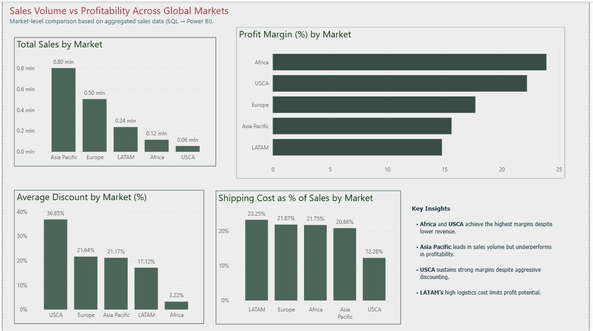

# Sales & Profitability Analysis – SQL + Power BI

This project demonstrates an end-to-end, business-led analytical workflow combining SQL as the calculation layer with Power BI for modelling and visual storytelling.

Using a transactional Global Superstore dataset, the analysis focuses on comparing sales performance, profitability, discounting behaviour, and shipping cost efficiency across global markets.

The primary objective was to produce transparent, decision-ready metrics rather than visually dense or purely technical outputs.

The dashboard highlights situations where high revenue does not translate into strong profit margins, as well as cases where operational costs or discount pressure significantly impact profitability.

The final output is a concise, business-oriented report designed to support pricing, discount optimisation strategies, and logistics efficiency discussions for non-technical stakeholders.

---

## Project Overview

This analysis focuses on answering key business questions at **market level**, including:

- Which markets generate the highest sales?
- Which markets are the most profitable?
- How do discount strategies differ across regions?
- How does shipping cost impact profitability?

The workflow follows a clear sequence:
**raw data → SQL aggregation → Power BI modelling → business insights**.

---

## Dataset

The project is based on the **Global Superstore** dataset, a commonly used retail dataset available on Kaggle.

- Source: Kaggle – Global Superstore Dataset
- Original data contains transactional-level sales records across multiple global markets.
- The dataset was cleaned and transformed before analysis.

Files used in this project:
- `Global_Superstore.csv` – original raw dataset
- `global_superstore_clean.csv` – cleaned version used for analysis
- `market_summary.csv` – market-level aggregated dataset created using SQL

---

## Tools Used

- **SQL (MySQL)** – data aggregation and metric calculation  
- **Power BI** – data modelling, measures, and dashboard creation  
- **Excel / CSV** – source and intermediate datasets  


---

## Skills Demonstrated

- Writing analytical SQL queries for aggregation and KPI creation  
- Designing end-to-end data pipelines (SQL → BI)  
- Financial and profitability analysis  
- Interpreting margin, cost, and discount structures  
- Building decision-focused dashboards  
- Translating technical outputs into business insights

---

## Repository Structure

```text
sales-profitability-analysis-sql-powerbi/
│
├── data/
│   ├── Global_Superstore.csv
│   ├── global_superstore_clean.csv
│   └── market_summary.csv
│
├── sql/
│   ├── 00_create_table.sql
│   └── 01_analysis_queries.sql
│
├── powerbi/
│   ├── sales-profitability-analysis-sql-powerbi.pbix
│   └── Theme.json
│
├── screenshots/
│   ├── dashboard-overview.png
│   ├── sql_market_level_aggregation.png
│   ├── model_powerbi.png
│   └── market_summary_table_powerbi.png
│
└── README.md
```

---

## SQL Analysis

SQL was used to aggregate transactional data into a **market-level summary table**.

Key metrics calculated in SQL:
- Total Sales
- Total Profit
- Profit Margin (%)
- Average Discount (%)
- Shipping Cost as % of Sales

The final query groups data by market and prepares it for direct use in Power BI.

Example output (market-level aggregation):

| Market        | Total Sales | Total Profit | Profit Margin (%) | Avg Discount (%) | Shipping Cost (%) |
|--------------|------------:|-------------:|------------------:|-----------------:|------------------:|
| Asia Pacific | 800,511.75  | 125,049.47   | 15.62             | 8.56             | 15.61             |
| Europe       | 503,568.21  | 89,122.08    | 17.70             | 8.75             | 16.37             |
| LATAM        | 236,263.49  | 34,929.35    | 14.78             | 6.92             | 17.40             |
| Africa       | 115,205.93  | 27,541.85    | 23.91             | 1.30             | 16.28             |
| USCA         | 55,259.64   | 12,271.60    | 22.21             | 14.90            | 9.19              |

---

## Power BI Dashboard

The aggregated dataset was imported into Power BI and modelled for analysis.

The dashboard includes:

- **Total Sales by Market**
- **Profit Margin (%) by Market**
- **Average Discount (%) by Market**
- **Shipping Cost as % of Sales by Market**


All visuals are built using SQL-derived metrics to ensure consistency and data accuracy.

---

### Dashboard Overview



> Dashboard built in Power BI using SQL-aggregated market-level data.

---

## Key Business Insights

- **Africa and USCA** achieve the highest profit margins despite lower sales volumes.
- **Asia Pacific** leads in total sales but underperforms in profitability.
- **USCA** maintains strong margins while applying aggressive discounting.
- **LATAM** shows the highest shipping cost burden relative to sales, limiting profit potential.

These insights highlight opportunities for margin optimisation and cost efficiency improvements.

---

## Notes

- The project is designed in a **recruitment-style format**: clear, focused, and business-driven.
- Emphasis is placed on **decision support**, not technical complexity.
- All calculations are transparent and reproducible.

---


## Deliverables

- SQL scripts (aggregation and KPI calculations)
- Power BI dashboard (.pbix)
- Cleaned and aggregated datasets
- Project documentation (README)

---

## About This Project
This project is part of my professional data analytics portfolio and demonstrates practical SQL and Power BI skills in a real-world business context.

